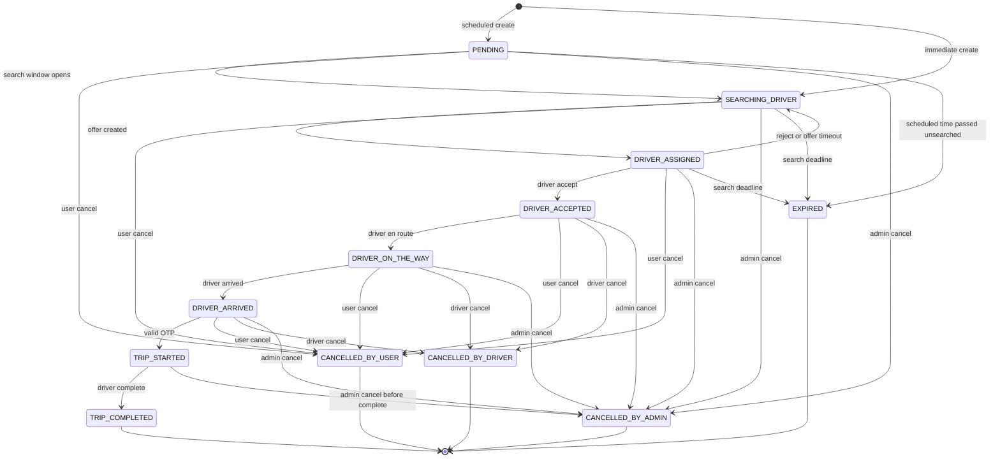

# Booking state machine

All booking status writes go through `BookingTransitionService`. The service loads the current status, checks the edge, updates the booking, and inserts `BookingStatusHistory` in one transaction. If the edge is not listed, the service returns 409 and writes nothing.

Clients never send a target status except through a named action (`cancel`, `accept`, `reject`, `en-route`, `arrived`, `start`, `complete`). Admin cancel is its own action. There is no generic "set status" endpoint.

`CANCELLED_BY_ADMIN` is part of this design so operations can stop a booking. Drop it only if admin must not cancel.

## 1. States

| Status | Meaning |
| --- | --- |
| PENDING | Scheduled booking is stored and search has not started |
| SEARCHING_DRIVER | Eligible drivers may be offered the booking |
| DRIVER_ASSIGNED | One driver has a pending offer |
| DRIVER_ACCEPTED | Assigned driver accepted. Trip row exists |
| DRIVER_ON_THE_WAY | Driver is travelling to pickup |
| DRIVER_ARRIVED | Driver marked arrival. Start OTP exists |
| TRIP_STARTED | OTP matched. Trip clock is running |
| TRIP_COMPLETED | Trip ended. Terminal |
| CANCELLED_BY_USER | Terminal |
| CANCELLED_BY_DRIVER | Terminal |
| CANCELLED_BY_ADMIN | Terminal |
| EXPIRED | Search ended with no acceptance. Terminal |

## 2. Diagram

The only backward edge is `DRIVER_ASSIGNED → SEARCHING_DRIVER`. It is not a general undo.

## 3. Transition table

| From | To | Actor | Action | Guards |
| --- | --- | --- | --- | --- |
| — | PENDING | USER | create scheduled | `scheduledAt` inside the configured window. Fails if pricing is required and no approved quote rule exists |
| — | SEARCHING_DRIVER | USER | create immediate | Same pricing guard. Sets `searchExpiresAt` |
| PENDING | SEARCHING_DRIVER | SYSTEM | open search | Now is within the configured lead time and before `scheduledAt` |
| PENDING | EXPIRED | SYSTEM | expire | `scheduledAt` passed and search never started |
| SEARCHING_DRIVER | DRIVER_ASSIGNED | SYSTEM | offer | Driver is online, KYC approved, account active, no other accepted booking, inside radius. Creates `BookingOffer` PENDING |
| DRIVER_ASSIGNED | DRIVER_ACCEPTED | DRIVER | accept | Offer belongs to this driver and is PENDING. Other pending offers for this booking are expired. Creates Trip |
| DRIVER_ASSIGNED | SEARCHING_DRIVER | DRIVER or SYSTEM | reject or offer timeout | Offer closed. Booking returns to search if `now < searchExpiresAt` |
| SEARCHING_DRIVER or DRIVER_ASSIGNED | EXPIRED | SYSTEM | expire search | `now >= searchExpiresAt` and no acceptance |
| DRIVER_ACCEPTED | DRIVER_ON_THE_WAY | DRIVER | en-route | Caller is the assigned driver |
| DRIVER_ON_THE_WAY | DRIVER_ARRIVED | DRIVER | arrived | Caller is the assigned driver. Generates OTP hash |
| DRIVER_ARRIVED | TRIP_STARTED | DRIVER | start | OTP hash matches. Sets `otpVerifiedAt` and `startedAt` |
| TRIP_STARTED | TRIP_COMPLETED | DRIVER | complete | Sets `endedAt`. Financial recognition starts only in the payment phase, and only through the payment service |
| listed cancel edges | CANCELLED_BY_USER | USER | cancel | Caller owns the booking. Reason required |
| listed cancel edges | CANCELLED_BY_DRIVER | DRIVER | cancel | Caller is the assigned driver. Reason required. Not allowed before accept |
| listed cancel edges | CANCELLED_BY_ADMIN | ADMIN | cancel | Reason required. Audit log required |

User and driver cancellation fees are not charged until cancellation policy values are approved. Until then, cancel changes status and records the reason, and the fee amount is zero with a snapshot that says the policy was not configured. That behavior needs a yes in approval if Phase 3 includes cancel.

## 4. Illegal examples

- `SEARCHING_DRIVER → TRIP_STARTED`
- `DRIVER_ARRIVED → TRIP_STARTED` with a missing or wrong OTP
- `TRIP_COMPLETED →` anything
- `CANCELLED_* →` anything
- `EXPIRED → SEARCHING_DRIVER`
- `TRIP_STARTED → CANCELLED_BY_USER` or `CANCELLED_BY_DRIVER`
- A driver accepting an offer that is not theirs
- A second accept while another driver is already `DRIVER_ACCEPTED`
- Any update that sets `status` from a raw request body

## 5. Side effects

| Entering | Effect |
| --- | --- |
| DRIVER_ASSIGNED | Notify the offered driver |
| DRIVER_ACCEPTED | Notify the user. Create Trip. Driver is not offered other bookings |
| SEARCHING_DRIVER after reject | Notify nobody of the rejection text beyond the customer status "still searching" |
| DRIVER_ARRIVED | Create OTP. Notify the user |
| TRIP_STARTED | Notify the user. Location stream is the on-trip interval |
| TRIP_COMPLETED | Notify both. Stop sharing live location. Hand off to payment recognition |
| CANCELLED_* or EXPIRED | Notify the other party. Close open offers. Revoke unused OTP |

Notification delivery is Phase 4. Phase 3 records the status and history even if push is not wired yet.

## 6. Concurrency

Accept uses a conditional update: status is still `DRIVER_ASSIGNED` and the offer is still `PENDING`. If two actions race, one wins and the other receives 409.

Search expiry and offer timeout are written by a scheduled job in the API process (or a later worker). The job uses the same transition service. It does not update status with a direct repository write.
